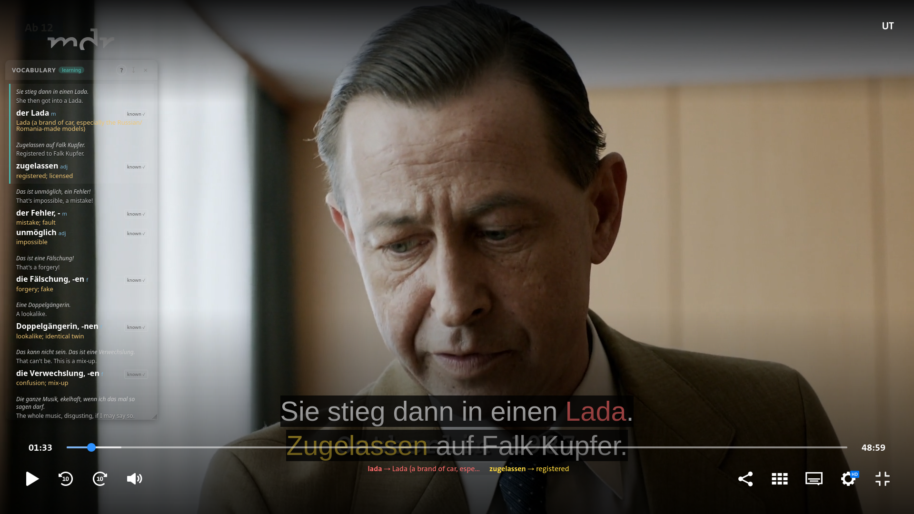

# ARD Mediathek Bilingual Subtitles

A Firefox extension that helps you **learn German** while watching ARD Mediathek videos by providing intelligent vocabulary support, interactive translations, and active learning features.

## Motivation

I love the content on ARD Mediathek, but as a German learner, I needed more than just subtitles—I needed a tool that would help me **actively learn** rather than passively read translations. This extension bridges the gap between comprehension and learning by:

- Encouraging you to **try understanding the German first** before revealing translations
- Extracting and highlighting **B1-level vocabulary** that's genuinely useful for intermediate learners
- Tracking which sentences you needed help with, so you can focus on weak spots
- Making vocabulary **visually obvious** with color-coding and inline translations
- Exporting everything to Anki for long-term retention

## Features

### 🧠 Learning Mode (Active Learning)
- **Hidden translations by default**: When you pause, the English translation doesn't appear immediately
- **Configurable think time**: After pausing, you get N seconds to try understanding the German before a subtle hint appears
- **Press `T` to reveal**: Hit `T` (or click the hint) when you need the translation
- **Optional auto-hide**: The translation can disappear after N seconds, forcing you to recall it again
- **Recall tracking**: Sentences where you pressed `T` are marked with a red dot—these are your weak spots
- **Switch to passive mode** with `C-x l` if you just want to watch without the challenge

### 🎨 Color-Coded Vocabulary Highlights
- **AI-extracted vocabulary**: Cerebras or Groq LLM identifies genuine B1-level words (Goethe-Zertifikat standard)
- **Inline highlights**: Extracted words are color-coded directly in the subtitle text
- **Current-subtitle legend**: A draggable overlay shows **only the words from the currently visible subtitle**, with their English meanings
- **Click to lookup**: Click any highlighted word to open the vocab panel and jump to its full entry
- **Hover tooltips**: Hover over a highlighted word to see a quick translation

### 📚 Vocabulary Panel (`C-x C-x`)
- **Grouped by sentence**: Words are organized by the example sentence they appeared in
- **Active/recent highlighting**: The current subtitle's group is highlighted in teal; recently seen groups are in soft yellow
- **Mark as known**: Click `known ✓` on any word to remove it permanently—it won't be highlighted or suggested again
- **Recall indicators**: Red dots mark words from sentences where you needed the translation
- **Anki export**: Download a TSV file with all vocabulary. Words with recall indicators get the `recall-needed` tag for aggressive Anki scheduling
- **Draggable & resizable**: Grab the header to move it; drag the bottom-right corner to resize
- **Opacity controls**: `C-+` / `C--` to adjust transparency

### ⌨️ Keyboard Shortcuts
| Shortcut | Action |
|----------|--------|
| `T` | Reveal English translation (learning mode, while paused) |
| `C-x C-x` | Toggle vocabulary panel |
| `C-x l` | Toggle **learning** / **passive** mode |
| `C-x h` | Toggle inline word translations on/off |
| `C-x ?` | Show help overlay |
| `C-+` | Increase vocab panel opacity |
| `C--` | Decrease vocab panel opacity |
| `Esc` | Close help overlay |

## Installation

### From Firefox Add-ons (AMO)
*Coming soon*

### Manual Installation (Development)
1. Download or clone this repository
2. Open Firefox and navigate to `about:debugging#/runtime/this-firefox`
3. Click **Load Temporary Add-on**
4. Select the `manifest.json` file from this directory

## Setup

1. Get a free API key:
   - **Cerebras**: [cloud.cerebras.ai](https://cloud.cerebras.ai) (recommended—faster, larger context)
   - **Groq**: [console.groq.com](https://console.groq.com)

2. Open Firefox's Add-ons Manager (`about:addons`)
3. Find **ARD Mediathek Subtitle Translator** → **Preferences**
4. Enter your API key and configure:
   - **Think time**: Seconds before the "press T" hint appears (default: 2)
   - **Auto-hide delay**: Seconds before translation hides itself again (default: 0 = stay visible)
   - **Font sizes**: Adjust subtitle translation and vocabulary panel text size

## Usage

1. Open any ARD Mediathek video: `https://www.ardmediathek.de/video/*`
2. Enable German subtitles if not already on
3. **Pause the video** to see translations (learning mode) or watch with vocabulary highlights (passive mode)
4. Press `C-x C-x` to open the vocabulary panel
5. Mark words as known, export to Anki, and track your progress

## Technical Details

- **Vocabulary extraction**: Uses Cerebras Llama 3.3 70B or Groq Llama 3.1 70B with a carefully tuned prompt that:
  - Excludes extensive A1/A2 vocabulary (700+ words)
  - Targets genuine B1-level words (Goethe-Zertifikat standard)
  - Limits output to 6-8 high-value words per batch
  - Provides example sentences with translations
- **Translation**: Google Translate API for subtitle translation
- **Storage**: API keys, known words, and recall tracking stored locally with `browser.storage.local`
- **Subtitle detection**: MutationObserver tracks subtitle DOM changes and text updates in real-time
- **Color consistency**: Each word gets a consistent color from an 8-color palette based on its position in the vocab array

## Privacy

- **No telemetry**: This extension does not collect or transmit any usage data
- **Local storage only**: Your API keys, known words, and settings are stored locally in Firefox
- **Third-party API calls**: Subtitle text is sent to:
  - Google Translate API (for translation)
  - Cerebras or Groq API (for vocabulary extraction, using your own API key)

## Known Limitations

- **ARD Mediathek only**: Currently only works on `ardmediathek.de` video pages
- **German subtitles required**: The extension detects subtitles with `lang="de-DE"` or `lang="de"`
- **No offline mode**: Requires internet connection for translation and vocabulary extraction

## Future Enhancements

- Support for other German streaming platforms (ZDF, Arte, etc.)
- Configurable vocabulary difficulty level (A2, B2, C1)
- Spaced repetition integration (direct Anki-Connect sync)
- User-configurable color palettes for highlights

## Contributing

Contributions are welcome! Please open an issue or PR if you have ideas for improvements.

## License

MIT License - see [LICENSE](LICENSE) file for details.

## Acknowledgments

- Built with Firefox WebExtensions API
- LLM vocabulary extraction powered by Cerebras and Groq
- Translation via Google Translate API
- Inspired by the need for better language learning tools for intermediate German learners
